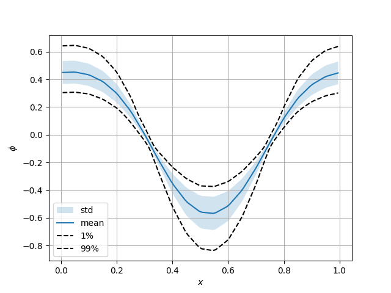
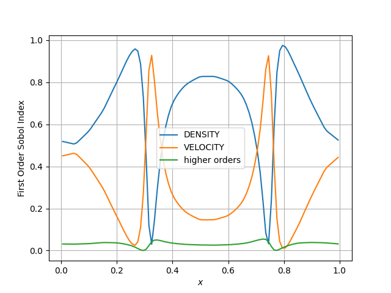

# UQ of NESO
Example scripts using [EasyVVUQ](https://easyvvuq.readthedocs.io/en/dev/) to quantify the uncertainty in the electrostatic potential as a function of the initial particle velocity and the particle charge and number density (NOTE: these are set to the same value).

## Usage
 - Run `pip install -r requirements.txt`
 - Modify the `run.sh` to match your environment
 - Modify `python/campaign.py` file as required
 - run `python python/campaign.py`

## Explanation

This particular script `campaign.py` uses Polynomial Chaos Expansion(PCE) to estimate the uncertainty of the electrostatic potential  ($\phi$) as a function of two uniformly distributed random variables- the initial particle velocity ($v$) and the particle charge density ($\rho$) -  along a line $y=\mathrm{const}$. 

PCE estimates $\phi$ at each evaluation point ($x_n$) as a sum of orthogonal polynomials $\Phi$,

$$
\phi(x_n,v,\rho) \approx \sum_{k=0}^{k=N}c_k(x_n)\Phi_k(v,\rho).
$$

The number of runs required to calculate the approximation is  $(p + 1)^d$, $p$ is the polynomial order, and $d$ is the number of uncertain parameters. In this script $p=3$ and $d=2$, but virtually identical results are obtained with $p=2$ (see moments_2ndorder.png and sobols_2ndorder.png)

## Results

- DENSITY is the particle charge density and particle number density (these are always equal in this analysis)
- VELOCITY is the initial particle velocity
